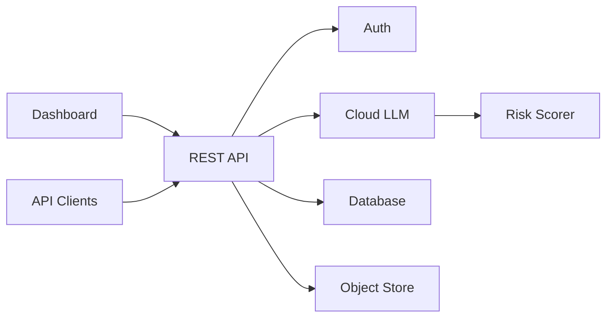
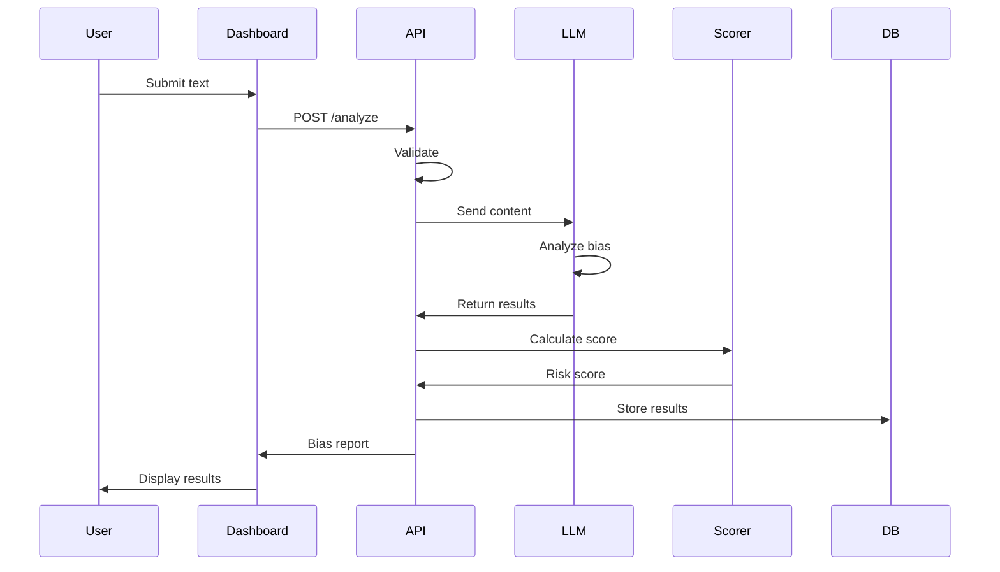
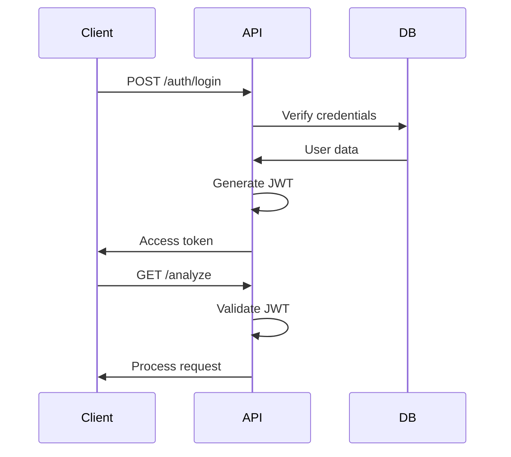

# Design Document

## Overview

BiasLens is a cloud-based AI-powered bias detection prototype built on AWS infrastructure. The system uses a single cloud-hosted Large Language Model (LLM) to analyze text content, detecting implicit political, gender, religious, and ideological bias. The same LLM handles bias detection, explanation generation, and neutral rewriting to ensure consistent contextual understanding throughout the analysis pipeline.

The architecture consists of four main layers: a React-based frontend dashboard, a Python REST API backend, an LLM-based analysis pipeline, and a cloud storage layer for persisting results and user data.

## Architecture

### High-Level Architecture



### System Components

#### Web Dashboard
- **Technology**: React with TypeScript
- **Responsibilities**: User interface for content submission, results visualization, analysis history
- **Features**: Text input area, bias highlighting, risk score display, explanation and suggestion viewing
- **Deployment**: Static hosting on AWS S3 + CloudFront or similar

#### Backend API Server
- **Technology**: Python with FastAPI or Flask
- **Responsibilities**: Request handling, authentication, LLM orchestration, data persistence
- **Endpoints**: Content analysis, user authentication, history retrieval
- **Deployment**: AWS EC2, Lambda, or App Runner
- **Authentication**: JWT-based session management with bcrypt password hashing

#### LLM Analysis Pipeline
- **Technology**: Cloud-hosted LLM service (OpenAI API, Anthropic Claude, AWS Bedrock, or similar)
- **Responsibilities**: Single unified LLM performs all analysis tasks:
  - Bias detection and classification (political, gender, religious, ideological)
  - Explanation generation for detected bias
  - Neutral rewrite suggestions
- **Approach**: Prompt engineering to guide the LLM through structured analysis
- **Output**: Structured JSON response with bias indicators, explanations, and suggestions

#### Risk Scorer
- **Technology**: Python scoring logic
- **Responsibilities**: Compute numerical risk score (0-100) from LLM-detected bias indicators
- **Algorithm**: Aggregates confidence scores from LLM output, applies category weighting
- **Classification**: Low (0-30), Medium (31-70), High (71-100) risk levels

#### Storage Layer
- **Database**: AWS RDS (PostgreSQL) or DynamoDB for user accounts and analysis records
- **Object Storage**: AWS S3 for content text and detailed analysis results
- **Data**: User credentials, analysis history, content items, bias reports

## Data Flow

### Content Analysis Flow



### API Authentication Flow



## LLM Analysis Pipeline

### Unified LLM Approach

BiasLens uses a single cloud-hosted Large Language Model for all analysis tasks, leveraging the LLM's contextual understanding capabilities through prompt engineering.

#### LLM Provider Options
- **OpenAI API**: GPT-4 or GPT-3.5-turbo
- **Anthropic**: Claude 3 (Opus, Sonnet, or Haiku)
- **AWS Bedrock**: Claude, Llama, or other foundation models
- **Google Cloud**: Gemini or PaLM models

#### Analysis Prompt Structure

The system sends a structured prompt to the LLM requesting:

1. **Bias Detection**: Identify phrases exhibiting political, gender, religious, or ideological bias
2. **Classification**: Categorize each detected bias instance
3. **Confidence Scoring**: Provide confidence level (0.0-1.0) for each detection
4. **Explanation Generation**: Explain why each phrase is considered biased
5. **Neutral Rewrites**: Suggest alternative phrasings that maintain meaning while reducing bias

#### LLM Response Format

The LLM returns structured JSON output:

```json
{
  "bias_indicators": [
    {
      "text": "detected biased phrase",
      "category": "gender|political|religious|ideological",
      "confidence": 0.85,
      "start_pos": 15,
      "end_pos": 35,
      "explanation": "Why this phrase exhibits bias",
      "suggestions": ["neutral alternative 1", "neutral alternative 2"]
    }
  ]
}
```

#### Advantages of Unified LLM Approach

- **Contextual Understanding**: Single model maintains context across detection, explanation, and rewriting
- **Consistency**: Explanations and rewrites directly relate to detected bias
- **Flexibility**: Prompt engineering allows rapid iteration without model retraining
- **Simplicity**: No need for multiple specialized models or complex orchestration
- **Cost-Effective**: Pay-per-use API pricing suitable for prototype scale

### Risk Scoring Algorithm

```python
def calculate_risk_score(bias_indicators):
    """
    Calculate composite risk score from LLM-detected bias indicators
    
    Args:
        bias_indicators: List of bias detections from LLM with confidence scores
    
    Returns:
        RiskScore object with overall and category-specific scores
    """
    if not bias_indicators:
        return RiskScore(overall=0, categories={}, risk_level="low")
    
    # Group indicators by category
    category_scores = {}
    for indicator in bias_indicators:
        category = indicator['category']
        confidence = indicator['confidence']
        
        if category not in category_scores:
            category_scores[category] = []
        category_scores[category].append(confidence)
    
    # Calculate average confidence per category (0-100 scale)
    for category in category_scores:
        avg_confidence = sum(category_scores[category]) / len(category_scores[category])
        category_scores[category] = int(avg_confidence * 100)
    
    # Calculate overall score as average of category scores
    overall_score = int(sum(category_scores.values()) / len(category_scores))
    
    # Classify risk level
    if overall_score <= 30:
        risk_level = "low"
    elif overall_score <= 70:
        risk_level = "medium"
    else:
        risk_level = "high"
    
    return RiskScore(
        overall=overall_score,
        categories=category_scores,
        risk_level=risk_level
    )
```

## API Endpoints

### Authentication Endpoints

#### POST /api/auth/register
Register a new user account.

**Request:**
```json
{
  "email": "user@example.com",
  "password": "securepassword"
}
```

**Response:**
```json
{
  "user_id": "uuid",
  "email": "user@example.com",
  "message": "Registration successful"
}
```

#### POST /api/auth/login
Authenticate user and return JWT access token.

**Request:**
```json
{
  "email": "user@example.com",
  "password": "securepassword"
}
```

**Response:**
```json
{
  "access_token": "jwt_token_string",
  "user_id": "uuid",
  "email": "user@example.com"
}
```

#### POST /api/auth/logout
End user session.

### Content Analysis Endpoints

#### POST /api/analyze
Analyze content for bias (requires authentication).

**Request Headers:**
```
Authorization: Bearer {jwt_token}
```

**Request Body:**
```json
{
  "content": "string (max 10,000 chars)"
}
```

**Response:**
```json
{
  "analysis_id": "uuid",
  "risk_score": {
    "overall": 67,
    "risk_level": "medium",
    "categories": {
      "political": 45,
      "gender": 78,
      "religious": 12,
      "ideological": 34
    }
  },
  "bias_indicators": [
    {
      "text": "he is naturally better at",
      "category": "gender",
      "confidence": 0.89,
      "start_pos": 15,
      "end_pos": 35,
      "explanation": "Implies gender-based capability assumptions",
      "suggestions": [
        "they are naturally better at",
        "this person excels at"
      ]
    }
  ],
  "timestamp": "2024-01-15T10:30:00Z"
}
```

### History Endpoints

#### GET /api/history
Retrieve user's analysis history (requires authentication).

**Request Headers:**
```
Authorization: Bearer {jwt_token}
```

**Response:**
```json
{
  "analyses": [
    {
      "analysis_id": "uuid",
      "content_preview": "First 100 characters...",
      "risk_score": 67,
      "risk_level": "medium",
      "timestamp": "2024-01-15T10:30:00Z"
    }
  ]
}
```

#### GET /api/history/{analysis_id}
Retrieve specific analysis result (requires authentication).

**Response:**
```json
{
  "analysis_id": "uuid",
  "content": "full content text",
  "risk_score": {...},
  "bias_indicators": [...],
  "timestamp": "2024-01-15T10:30:00Z"
}
```

## Database Design

### Database Schema

The system uses a cloud database (AWS RDS PostgreSQL or DynamoDB) with the following schema:

```sql
-- Users table
CREATE TABLE users (
    id UUID PRIMARY KEY DEFAULT gen_random_uuid(),
    email VARCHAR(255) UNIQUE NOT NULL,
    password_hash VARCHAR(255) NOT NULL,
    created_at TIMESTAMP DEFAULT NOW()
);

-- Content analyses table
CREATE TABLE analyses (
    id UUID PRIMARY KEY DEFAULT gen_random_uuid(),
    user_id UUID REFERENCES users(id),
    content TEXT NOT NULL,
    overall_risk_score INTEGER NOT NULL,
    risk_level VARCHAR(20) NOT NULL,
    category_scores JSONB NOT NULL,
    bias_indicators JSONB NOT NULL,
    created_at TIMESTAMP DEFAULT NOW()
);

-- Indexes for performance
CREATE INDEX idx_analyses_user_id ON analyses(user_id);
CREATE INDEX idx_analyses_created_at ON analyses(created_at DESC);
```

### Data Storage Strategy

#### User Data
- **Table**: `users`
- **Fields**: User ID, email, password hash (bcrypt), creation timestamp
- **Access Pattern**: Lookup by email for authentication, lookup by ID for session validation

#### Analysis Results
- **Table**: `analyses`
- **Fields**: Analysis ID, user ID, content text, risk scores, bias indicators (JSON), timestamp
- **Storage**: Complete analysis results stored as JSON for easy retrieval
- **Access Pattern**: List by user ID for history, retrieve by analysis ID for details

#### Object Storage (AWS S3)
- **Purpose**: Optional storage for large content items or exported reports
- **Structure**: `{user_id}/{analysis_id}/content.txt`
- **Use Case**: Offload large text content from database if needed

## Tech Stack

### Frontend
- **Framework**: React 18+ with TypeScript
- **State Management**: React Context API or Zustand (lightweight)
- **UI Components**: Material-UI or Tailwind CSS
- **HTTP Client**: Axios or Fetch API
- **Build Tool**: Vite
- **Deployment**: AWS S3 + CloudFront (static hosting)

### Backend
- **Language**: Python 3.11+
- **Framework**: FastAPI or Flask
- **Authentication**: JWT with PyJWT, bcrypt for password hashing
- **LLM Integration**: OpenAI Python SDK, Anthropic SDK, or AWS Boto3 (Bedrock)
- **Database ORM**: SQLAlchemy (for PostgreSQL) or boto3 (for DynamoDB)
- **HTTP Server**: Uvicorn (FastAPI) or Gunicorn (Flask)
- **Deployment**: AWS EC2, Lambda, or App Runner

### Database & Storage
- **Database**: AWS RDS (PostgreSQL) or DynamoDB
- **Object Storage**: AWS S3 (optional, for large content)
- **Caching**: Optional in-memory caching for LLM responses

### AI/ML
- **LLM Provider**: OpenAI API, Anthropic Claude, AWS Bedrock, or Google Cloud
- **Approach**: API-based inference (no local model hosting)
- **Prompt Engineering**: Structured prompts for bias detection, explanation, and rewriting

### Infrastructure
- **Cloud Provider**: AWS
- **Compute**: EC2 instances or Lambda functions
- **Networking**: VPC, security groups, HTTPS via ACM
- **Secrets Management**: AWS Secrets Manager or environment variables
- **Deployment**: Manual deployment or simple CI/CD with GitHub Actions

## Performance Considerations

### Response Time Expectations
- **LLM API Calls**: 2-10 seconds depending on content length and LLM provider
- **Database Operations**: <100ms for user authentication and data retrieval
- **Total Analysis Time**: 3-15 seconds for typical content (up to 10,000 characters)

### Optimization Strategies
- **Caching**: Optional in-memory caching for repeated content analysis
- **Async Processing**: Non-blocking API calls to LLM service
- **Connection Pooling**: Database connection pooling for efficient resource usage
- **Static Asset CDN**: CloudFront for fast frontend delivery

### Scalability Approach
- **Stateless Backend**: API server can scale horizontally if needed
- **LLM Provider Scaling**: Cloud LLM services handle scaling automatically
- **Database**: Start with single instance, add read replicas if traffic grows
- **Cost Management**: Monitor LLM API usage to control costs

## Security & Privacy

### Data Protection
- **Encryption**: HTTPS/TLS for all data in transit
- **Password Security**: Bcrypt hashing for user passwords
- **Data Storage**: User content stored securely in cloud database
- **Access Control**: JWT-based authentication, users can only access their own data

### Security Measures
- **Authentication**: Email/password with JWT tokens
- **API Security**: Token-based authentication for all protected endpoints
- **Infrastructure**: AWS security groups, VPC configuration
- **Environment Variables**: Sensitive credentials (LLM API keys, database passwords) stored as environment variables or AWS Secrets Manager

### Privacy Considerations
- **Data Retention**: Analysis results stored for user access, can be deleted on request
- **Content Privacy**: User content only accessible by the user who submitted it
- **LLM Provider**: Content sent to third-party LLM service for analysis (review provider's privacy policy)
- **Minimal Data Collection**: Only collect email, password, and submitted content


## Deployment Strategy

### Development Environment
- **Local Development**: Run backend API locally with Python virtual environment
- **Frontend Development**: React dev server with Vite
- **Database**: Local PostgreSQL instance or AWS RDS development instance
- **LLM Integration**: Use development API keys with rate limits

### Production Deployment

#### Frontend Deployment
1. Build React application: `npm run build`
2. Upload build artifacts to AWS S3 bucket
3. Configure S3 for static website hosting
4. Optional: Set up CloudFront CDN for faster delivery

#### Backend Deployment
1. Package Python application with dependencies
2. Deploy to AWS EC2 instance, Lambda, or App Runner
3. Configure environment variables (database URL, LLM API keys)
4. Set up HTTPS with AWS Certificate Manager
5. Configure security groups and networking

#### Database Setup
1. Create AWS RDS PostgreSQL instance or DynamoDB table
2. Run database migrations to create schema
3. Configure backup and retention policies
4. Set up connection pooling

### Deployment Checklist
- [ ] LLM API keys configured
- [ ] Database connection string set
- [ ] JWT secret key generated
- [ ] HTTPS/SSL certificates configured
- [ ] CORS settings configured for frontend domain
- [ ] Environment variables secured
- [ ] Database schema initialized

## Monitoring & Logging

### Basic Monitoring
- **Application Logs**: Python logging to stdout/stderr
- **AWS CloudWatch**: Collect logs from EC2/Lambda for debugging
- **Error Tracking**: Log exceptions and API errors for troubleshooting
- **Health Endpoint**: Simple `/health` endpoint for uptime monitoring

### Key Metrics to Track
- **API Response Times**: Monitor LLM API call duration
- **Error Rates**: Track failed requests and LLM API errors
- **Usage Metrics**: Number of analyses per day, active users
- **Cost Tracking**: Monitor LLM API usage costs

### Logging Best Practices
- **Structured Logging**: Use JSON format for easier parsing
- **Log Levels**: INFO for normal operations, ERROR for failures, DEBUG for development
- **Sensitive Data**: Never log user passwords or API keys
- **Request IDs**: Include unique request IDs for tracing requests through the system

## Future Enhancements

The following features could be added in future iterations:

### Enhanced Analysis
- **Multilingual Support**: Extend beyond English to other languages
- **Batch Processing**: Analyze multiple documents at once
- **Custom Bias Categories**: Allow users to define custom bias types
- **Severity Levels**: More granular risk classification

### User Experience
- **Browser Extension**: Analyze content directly in the browser
- **Rich Text Editor**: In-place editing with real-time bias highlighting
- **Export Reports**: Download analysis results as PDF or CSV
- **Analysis History Search**: Search and filter past analyses

### Platform Features
- **Team Collaboration**: Share analyses with team members
- **API Rate Limiting**: Implement usage quotas and rate limits
- **Webhook Notifications**: Notify external systems of completed analyses
- **Analytics Dashboard**: Visualize bias trends over time

### Integration Options
- **CMS Plugins**: WordPress, Medium, or other content platforms
- **API Integrations**: Connect with writing tools and editors
- **Social Media**: Analyze social media posts before publishing